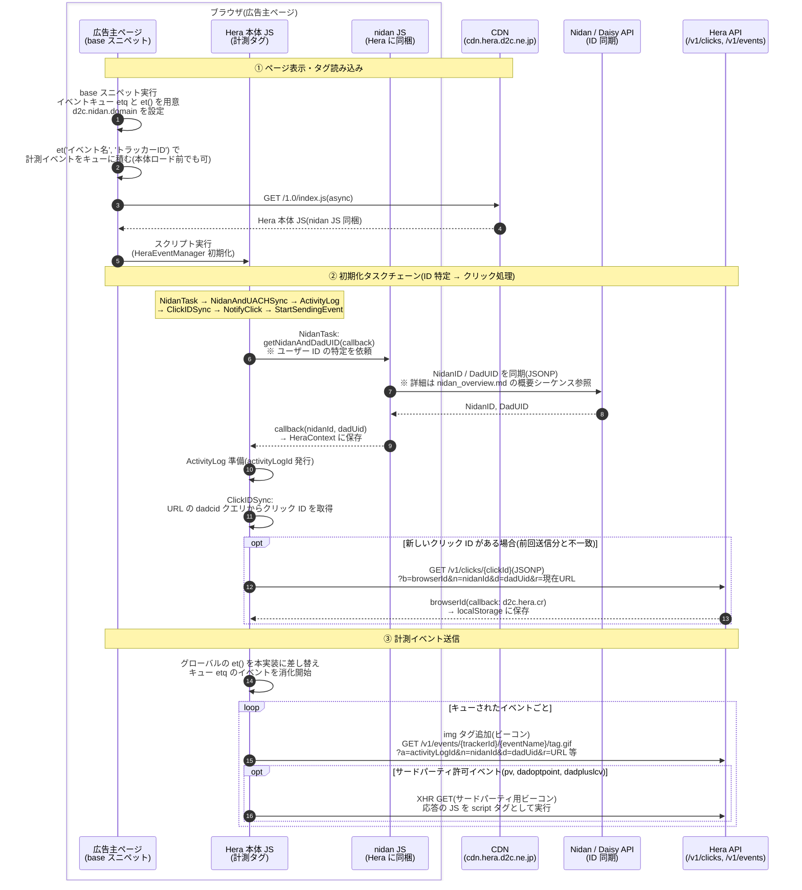

# Hera からの呼び出しシーケンス

対象: [d2c-zeus/nidan-hera-js の src/hera](https://github.com/d2c-zeus/nidan-hera-js/tree/master/src/hera) 配下。

Hera は**広告主ページに貼られる広告効果測定用の計測タグ**。
弊社がユニークに付与しているユーザー ID(NidanID / DadUID)を特定するために、
同梱された NidanJS の関数(`NidanIdManager.getNidanAndDadUID` = `getIds` 相当)を利用し、
特定した ID を計測イベント(コンバージョン等)に付与して送信する。

構成要素:
- **base スニペット**(`src/hera/src/base/base.prod.js`) — 広告主ページに直接貼られる短い JS。イベントキュー `etq` と登録関数 `et()` を用意し、CDN から Hera 本体を非同期ロードする。
- **Hera 本体 JS**(`src/hera/src/*.ts` → index.js) — `tsconfig.hera.json` のビルドで **nidan のコードを同梱**した単一スクリプト。

## 補足

- **ID 特定が最優先**: タスクチェーンの先頭が NidanTask であり、NidanID / DadUID が確定するまで計測イベントは送信されない(キューに滞留する)。ID を必ずイベントに紐付けるための設計。
- **cp フラグ**: `d2c.hera.cp` が false の場合は NidanTask の代わりに GetDaisyIdTask が使われ、DadUID のみで動作する(NidanID はイベントに付与されない)。
- **イベント URL のパラメータ**: `a` = activityLogId、`n` = NidanID、`d` = DadUID、`r` = ページ URL、`b` = browserId、`nt` = Navigation Timing 種別。キャッシュバスター `cb` も付与される。
- **クリック計測**: 広告クリックで遷移してきた場合、ランディング URL の `dadcid` パラメータをクリック ID として `/v1/clicks/` に通知し、返却された browserId を localStorage に保持する(クリック→コンバージョンの紐付け用)。同じクリック ID は再送しない。
- **アナリティクスモード**: URL に特定のクエリ(ビルド時埋め込みのキー/値)が付いている場合、ClickIDSync はアナリティクス用 API からクリック ID を JSONP で取得する経路に切り替わる。
