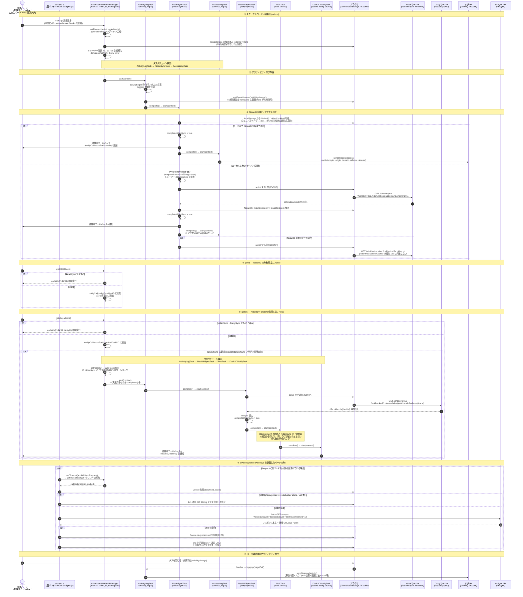

# nidan 詳細シーケンス(タスクチェーンの粒度)

対象: [d2c-zeus/nidan-hera-js の src/nidan](https://github.com/d2c-zeus/nidan-hera-js/tree/master/src/nidan) 配下の TypeScript 全体。
内部のタスクチェーン(`Task<T>`)の動きまで含めた詳細版。概要版は [nidan_overview.md](nidan_overview.md) を参照。

## 補足(重要な設計ポイント)

- **タスクチェーン**: `Task<T>`(task.ts)が Chain of Responsibility の基底クラス。`complete()` が次タスクの `start(context)` を呼ぶ。初期化時は「ActivityLog → NidanSync → AccessLog」、getIds 初回時は「ActivityLog → DadUIDSync → Wait → DadUIDNotify」の 2 チェーンが動く。
- **非同期待ち合わせ**: `getId` / `getIds` は「同期済みなら即時コールバック、未同期ならキューに積んで完了時に一括通知」。DadUID 側は `requestedDaisySync` フラグで初回のみ同期を起動し、`WaitTask` が NidanSync / DaisySync 両方の完了を待ち合わせる。
- **サーバー通信**: ID 同期はすべて JSONP(script タグ挿入)方式。コールバック名は通信量削減のため `ns`(NidanSync)/ `pd`(PublicationCookieDelete)/ `ds`(DadUIDSync)に短縮。
- **ログ送信**: `navigator.sendBeacon` を使用。`activityLogId` はページ内で 1 つに固定され、アクセスログとアクティビティログを紐付ける。NidanID をローカルで解決できなかった場合、その回のアクセスログは送信されない。
- **設定**: `environment.ts` が接続先 URL・ストレージキー等を保持し、`window._d2c_nidan_option` で一部上書き可能。ログ API ドメインはビルド時に `gulp-preprocess` で環境ごとに埋め込まれる(`env/*.js`)。
- **未使用コード**: `lib/uach.ts`(UACHTask)は全体がコメントアウトされており現在は未使用。

※ 大元リポジトリの `docs/nidan-sequence-diagram.md` には getId / getIds で分割された 2 枚の図があるが、本書はそれらと DASync・ログ送信を含む全体を 1 本に統合したもの。
