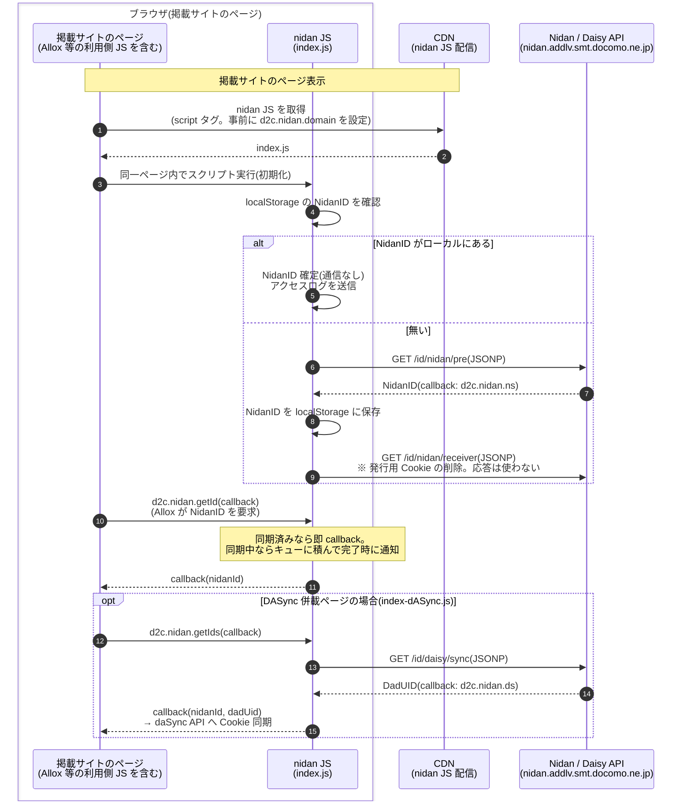

# nidan 概要シーケンス図

対象: [d2c-zeus/nidan-hera-js の src/nidan](https://github.com/d2c-zeus/nidan-hera-js/tree/master/src/nidan) 配下の TypeScript 全体。呼び出し契機ごとの概要シーケンスと関連ドキュメントの入口。

## ビルド構成(tsconfig / gulp より)

- **index.js(nidan 本体)** — `tsconfig.nidan.json` により `src/nidan/src/main.ts` + `src/nidan/src/lib/*.ts` を単一ファイルに結合(`outFile`)。`namespace d2c.nidan` の単一アプリ。
- **index-dASync.js(DASync)** — `tsconfig.dasync.json` により `src/nidan/src/lib-dasync/dasync.ts` のみを別バンドル化。本体 index.js と同じページに並載され、本体の `d2c.nidan.getIds` を呼び出して動作する(index-dasync.html 参照)。

nidan はメディアサイト(掲載サイト)に設置されるブラウザ用 ID 同期 SDK で、`task.ts` の `Task<T>` 基底クラスによるタスクチェーンで NidanID / DadUID(DaisyID)の同期とログ送信を行う。全タスクは `context.ts` の `NidanContext`(完了フラグ・コールバックキュー)を共有する。

nidan の呼び出し契機は 2 種類あり、それぞれ概要シーケンス(ブラウザ / CDN / JS / API の粒度)を用意している。

1. **掲載サイト契機**(本ページ下記) — 掲載サイト(メディア)に nidan JS 単体(index.js)が設置され、ページ表示を契機に NidanID を同期する。Allox が `getId` で NidanID を利用する。
2. **Hera タグ契機**([hera_call.md](hera_call.md)) — 広告主ページに貼られた広告効果測定タグ Hera が、ユーザー ID 特定のために同梱 nidan の `getNidanAndDadUID`(= `getIds`)を呼び出す。

関連:
- Prebid 連携時の ID 取得シーケンスと遅延分析(現行 pubProvidedId 方式 / User ID サブモジュール方式の比較)は [prebid_id_integration.md](prebid_id_integration.md) を参照。
- ID 取得と ID 発行を分離した「あるべき姿」のシーケンスは [nidan_to_be.md](nidan_to_be.md) を参照。

## ① 掲載サイト契機の概要シーケンス

内部のタスクチェーンを省略し、コンポーネント間のやりとりだけに絞った流れ。

## ② Hera タグ契機の概要シーケンス

広告主ページの Hera 計測タグが nidan を呼び出す流れは **[hera_call.md](hera_call.md)** を参照。

## 詳細シーケンス(タスクチェーンの粒度)

内部のタスクチェーン(`Task<T>`)の動きまで含めた詳細版は **[nidan_detail.md](nidan_detail.md)** を参照。
