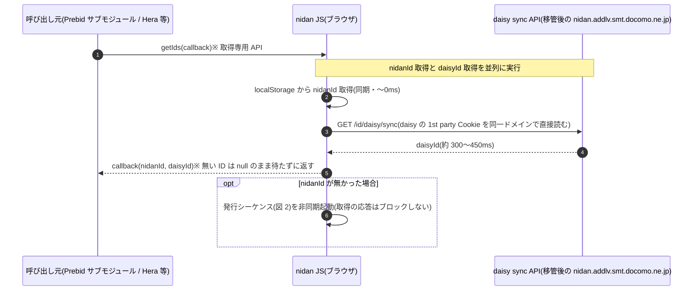
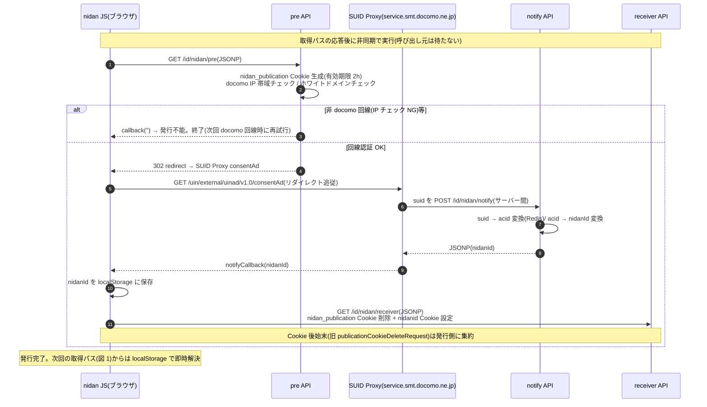

# nidan あるべき姿のシーケンス(ID 取得と ID 発行の分離)

現行の `getIds` は「ID 取得(高速にできるはず)」と「ID 発行(原理的に遅い)」が混在しており、
Prebid 等の呼び出し元が発行の遅延に巻き込まれる([prebid_id_integration.md](prebid_id_integration.md) 参照)。
本書は以下の合意事項を前提に、取得と発行を分離した「あるべき姿」を示す。

## 前提(合意事項)

1. **nidanId は回線認証の ID**。発行チェーンの起点は必ず SUID Proxy(JSONP / リダイレクト経由)であり、docomo 回線経由のときのみ発行できる(pre API に docomo IP 帯域チェックあり)。**初回の発行は原理的にオークション等へ間に合わないもの**として扱い、取得を邪魔しないバックグラウンド処理に切り出す。実際の発行フローは NidanID 発行フロー図(`nidan_id_publication.md`)、API 実装は [d2c-zeus/nidan-app](https://github.com/d2c-zeus/nidan-app) を参照。
2. **daisyId は daisy システムが docomo ドメインの 1st party Cookie として発行**している。現行の「CloudFront 代替ドメインで Cookie を間接的に読む」方式をやめ、**`nidan.addlv.smt.docomo.ne.jp` のドメイン移管を受けて、そのドメイン上に daisy sync API を立て、Cookie を直接受け取る**。daisyId はドコモドメイン 1st party Cookie としての利用が主目的のため、ITP 等の 3rd party Cookie 制限は問題にならない(その制限回避の受け皿が回線認証の nidanId という役割分担)。localStorage への焼き直しは不要。
3. **publicationCookieDeleteRequest(receiver への Cookie 後始末)は発行系**なので、発行シーケンス側に寄せる。

## 全体方針

- **取得パス(高速・同期中心)**: 「いま持っている ID を返すだけ」の API にする。nidanId は localStorage から同期取得、daisyId は移管ドメインの daisy sync API へ 1 往復。両者は**並列**に実行し、揃い次第即時コールバック。無い ID は**待たずに null で返す**(部分通知)。
- **発行パス(低速・非同期)**: nidanId が無かった場合のみ、取得パスの応答をブロックせずに裏で実行。SUID Proxy 経由の回線認証、receiver での Cookie 後始末までを含む。発行結果は localStorage に保存され、**次回の取得パスから有効**になる。

## 図 1: ID 取得シーケンス(あるべき姿)

- 取得パスの所要時間は **daisy sync の 1 往復 ≒ 300〜450ms が上限**になる(nidanId は同期)。現行のような「発行の完了待ち」「NidanSync → DaisySync の直列化」は発生しない。
- さらに詰めるなら、ページ先頭での `preconnect`(daisy sync API ドメイン)や、取得結果の Prebid storage キャッシュ(ケース D 相当)と組み合わせる。

## 図 2: ID 発行シーケンス(バックグラウンド・nidanId 不在時のみ)

NidanID 発行フロー図(`nidan_id_publication.md`)の現行発行フローを、取得から切り離して整理したもの。

## 現行との比較(呼び出し元から見た応答時間)

| | 現行 getIds | あるべき姿(取得専用) |
|---|---|---|
| 再訪問(nidanId あり) | 約 350〜700ms(DaisySync 完了待ち) | 約 300〜450ms(daisy 1 往復のみ。Prebid storage キャッシュ併用なら 〜0ms) |
| 初回(nidanId なし) | 約 700〜1,200ms(発行完了までブロック) | 約 300〜450ms で応答(nidanId=null + daisyId)。発行は裏で実行し次回から有効 |
| 非 docomo 回線 | 発行失敗まで待たされる | 即応答(nidanId=null)。発行リトライは裏側の関心事 |

- 呼び出し元(Prebid サブモジュール等)は「応答が daisy 1 往復以内に必ず返る」前提を置けるため、`auctionDelay`(300〜500ms)との組み合わせで**初回オークションから daisyId を乗せられる**見込みが立つ。
- nidanId が初回に乗らないのは回線認証の原理上の制約であり、あるべき姿では「待って間に合わせる」のではなく「待たせず、次回から確実に乗せる」設計に振る。
