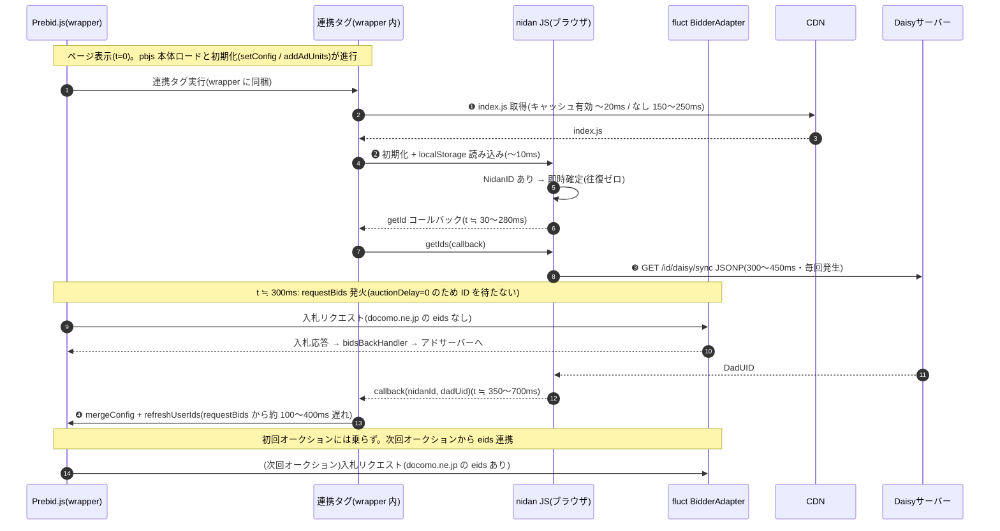
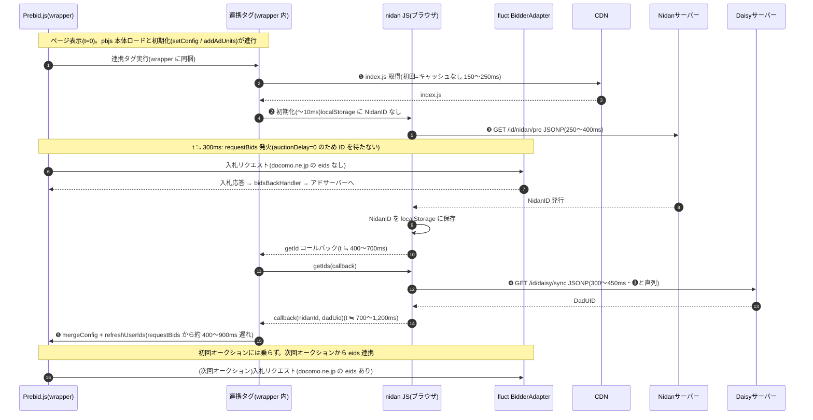

# Prebid 連携時の ID 取得遅延シーケンス

対象: `origin_apps/prebid/*/prd/*_D2CID_PubProvidedID.js`(連携タグ = NidanPrebid.js)+ `origin_apps/nidan-hera-js/src/nidan`(nidan JS)

Prebid wrapper 内部に nidan の連携タグが組み込まれている構成を前提に、
**nidan の ID 取得が Prebid の `requestBids` 開始からどれだけ遅れて戻るか**を、
localStorage に NidanID が「ある / ない」の 2 ケースで図示する。
ID の連携先として BidderAdapter(仮に **fluct**)のレーンを置いている。

## Prebid.js 側の処理フロー(公式ドキュメントより)

1. **初期化** — pbjs 本体(ビルド時に User ID モジュール・pubProvidedId・各 BidderAdapter を同梱)を非同期ロードし、`pbjs.que` に積まれたコマンドを実行(`setConfig` / `addAdUnits`)。
2. **requestBids** — ページ読み込み後すぐ(通常 数百 ms 以内)に発火。`userSync.auctionDelay` の**デフォルトは 0** で、**オークションはユーザー ID の取得を待たない**。
3. **Bidder 連携** — オークション開始時点で利用可能な eids だけを載せて、各 BidderAdapter(fluct 等)へ入札リクエストを送信。応答後 `bidsBackHandler` → アドサーバー(GAM 等)呼び出し。
4. **pubProvidedId の性質** — 非同期で得た ID は `pbjs.mergeConfig` + `pbjs.refreshUserIds` で後から登録する方式のため、**登録前に始まったオークションには乗らず、次回オークションから有効**になる。

## 前提条件(見積もりの根拠)

| 項目 | 想定値 |
|---|---|
| ネットワーク RTT | 約 50ms(モバイル 4G 〜 一般的な回線) |
| 新規オリジンへの接続確立(DNS + TCP + TLS) | 約 120〜150ms |
| pbjs 本体ロード 〜 requestBids 発火 | ページ表示から約 200〜500ms(本書では ≒300ms を基準に記載) |
| userSync.auctionDelay | 0(デフォルト。オークションは ID を待たない) |

数値はあくまで目安。回線・端末・サーバー負荷により変動する。

## ケース A: localStorage に NidanID がある場合(再訪問)

nidan の戻りは約 350〜700ms。**requestBids(≒300ms)から約 100〜400ms 遅れ**、初回オークションに乗らない可能性が高い。

| # | 遅延要因 | 目安 |
|---|---|---|
| ❶ | CDN からの index.js 取得 | キャッシュ有効 〜20ms / なし 150〜250ms |
| ❷ | 初期化(setTimeout + localStorage 読み込み) | 〜10ms |
| ❸ | DaisySync JSONP(毎回必須・最大要因) | 300〜450ms |
| ❹ | Prebid への反映(mergeConfig + refreshUserIds) | 〜10ms |
| | nidan の戻り合計 | 約 350〜700ms |
| | **requestBids(≒300ms)からの遅れ** | **約 100〜400ms** |

補足: ❸ は新規オリジン(docomo ドメイン)への接続確立 約 150ms + サーバー処理・転送 約 150〜300ms。daisyId は localStorage に保存されないため再訪問でも省略できない。

## ケース B: localStorage に NidanID がない場合(初回訪問)

nidan の戻りは約 700〜1,200ms。**requestBids(≒300ms)から約 400〜900ms 遅れ**、オークション自体が終わっている頃になる。

| # | 遅延要因 | 目安 |
|---|---|---|
| ❶ | CDN からの index.js 取得(初回=キャッシュなし) | 150〜250ms |
| ❷ | 初期化 | 〜10ms |
| ❸ | NidanID 発行 JSONP | 250〜400ms |
| ❹ | DaisySync JSONP(❸ と直列) | 300〜450ms |
| ❺ | Prebid への反映(mergeConfig + refreshUserIds) | 〜10ms |
| | nidan の戻り合計 | 約 700〜1,200ms |
| | **requestBids(≒300ms)からの遅れ** | **約 400〜900ms** |

補足:
- ❸ の後、Cookie 削除の JSONP(/id/nidan/receiver)も走るが、コールバック通知はブロックしない。
- nidan の設計上 DaisySync は `getIds` が呼ばれるまで開始されず、連携タグは `getId` 完了を待って `getIds` を呼ぶため、❸ と ❹ は並列化されない(所要時間が合計になる)。

## まとめ

| | ケース A(NidanID あり) | ケース B(NidanID なし) |
|---|---|---|
| nidan の戻り合計 | 約 350〜700ms | 約 700〜1,200ms |
| requestBids(≒300ms)からの遅れ | 約 100〜400ms | 約 400〜900ms |
| 初回オークションの入札リクエストに eids が乗るか | ほぼ乗らない | 乗らない |

関連: pubProvidedId ではなく専用の User ID サブモジュール(王道方式)にした場合の比較は [prebid_userid_module.md](prebid_userid_module.md) を参照。

- `auctionDelay` がデフォルト 0 のため、Prebid は ID を待たずに requestBids → fluct への入札リクエストを送る。nidan の戻りはどちらのケースでもそれより遅く、`mergeConfig` + `refreshUserIds` による登録は**初回オークション終了後**になる。連携 ID が効くのは次回オークション(リフレッシュ or 次ページ)から。
- 両ケースに共通する最大の恒常要因は DaisySync JSONP。daisyId が localStorage に永続化されないため、再訪問でも毎ページビューで docomo ドメインへの往復(約 300〜450ms)が必ず発生する。
- 対策の方向性: `userSync.auctionDelay` の設定(例: 200〜500ms)で初回オークションを ID 取得まで待たせる、daisyId のキャッシュ化、NidanSync と DaisySync の並列化など。
