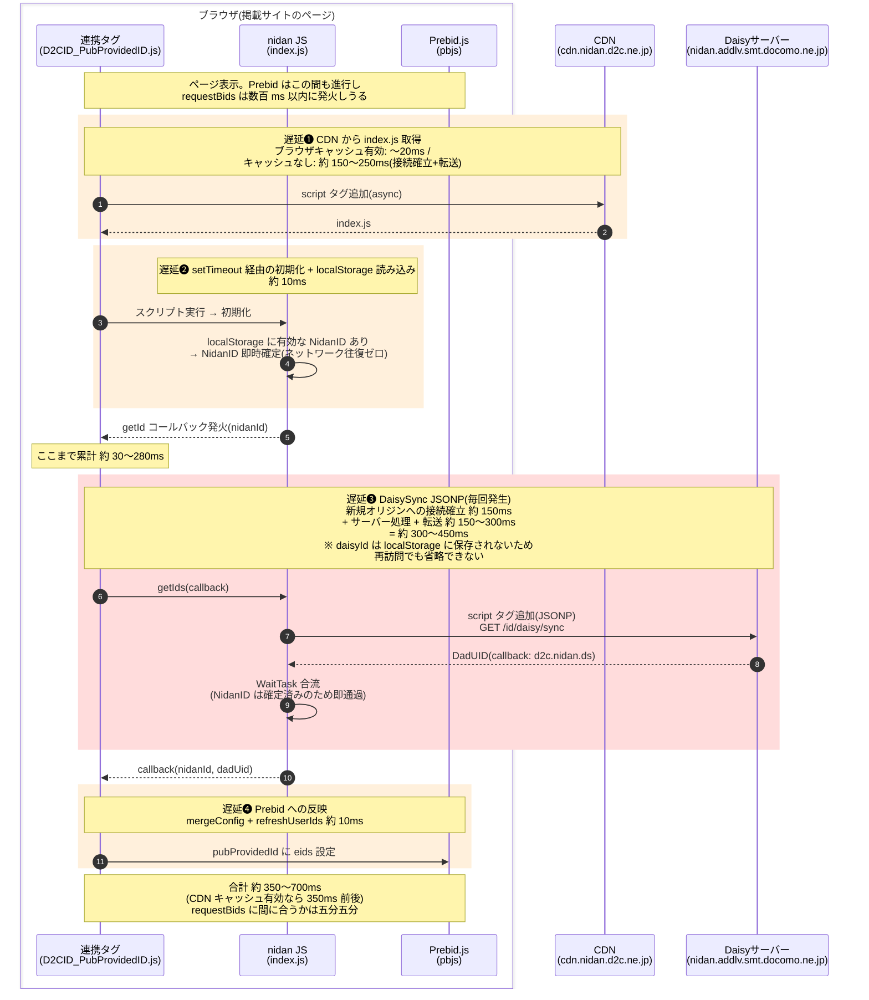
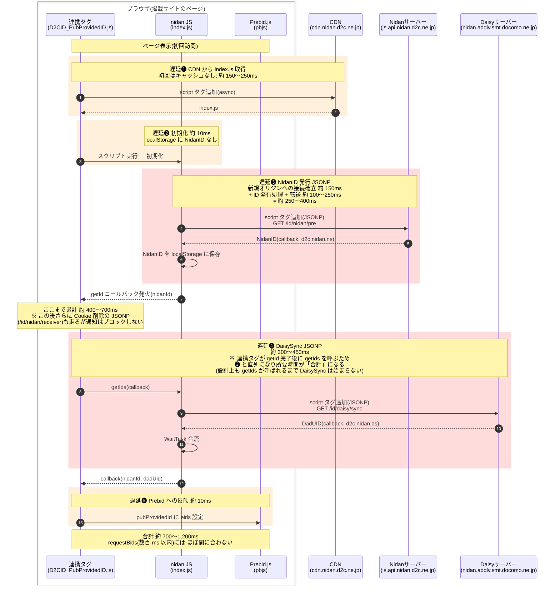

# Prebid 連携時の ID 取得遅延シーケンス

対象: `origin_apps/prebid/*/prd/*_D2CID_PubProvidedID.js`(連携タグ)+ `origin_apps/nidan-hera-js/src/nidan`(nidan JS)

Prebid の `pubProvidedId` へ NidanID / DadUID を渡すまでの遅延を、
**localStorage に NidanID がある場合(再訪問)/ ない場合(初回訪問)** の 2 ケースで図示する。

## 前提条件(見積もりの根拠)

| 項目 | 想定値 |
|---|---|
| ネットワーク RTT | 約 50ms(モバイル 4G 〜 一般的な回線) |
| 新規オリジンへの接続確立(DNS + TCP + TLS) | 約 120〜150ms |
| 小さな JS/JSONP 応答の転送 | 約 1 RTT(50ms)+ サーバー処理時間 |
| Prebid の `requestBids` 発火 | ページ読み込み後 数百 ms 以内が一般的(`auctionDelay` 未設定 = 0ms でオークションは ID を待たない) |

※ 数値はあくまで目安。回線・端末・サーバー負荷により変動する。

## ケース A: localStorage に NidanID が**ある**場合(再訪問) — 合計 約 350〜700ms

NidanID はローカルで即時解決するが、**DadUID(daisyId)は永続化されないため毎回 JSONP 往復が必須**。
これがこのケースの遅延のほぼすべてを占める。

| # | 遅延要因 | 目安 |
|---|---|---|
| ❶ | CDN からの index.js 取得 | キャッシュ有効 〜20ms / なし 150〜250ms |
| ❷ | 初期化(setTimeout + localStorage 読み込み) | 〜10ms |
| ❸ | **DaisySync JSONP(毎回必須・最大要因)** | **300〜450ms** |
| ❹ | Prebid への反映 | 〜10ms |
| | **合計** | **約 350〜700ms** |

## ケース B: localStorage に NidanID が**ない**場合(初回訪問) — 合計 約 700〜1,200ms

NidanID のサーバー発行(JSONP)が加わり、しかも連携タグが
「getId 完了 → getIds 呼び出し」と直列化しているため、**❸ と ❹ が並列にならず足し算になる**。

| # | 遅延要因 | 目安 |
|---|---|---|
| ❶ | CDN からの index.js 取得(初回=キャッシュなし) | 150〜250ms |
| ❷ | 初期化 | 〜10ms |
| ❸ | **NidanID 発行 JSONP** | **250〜400ms** |
| ❹ | **DaisySync JSONP(❸ と直列)** | **300〜450ms** |
| ❺ | Prebid への反映 | 〜10ms |
| | **合計** | **約 700〜1,200ms** |

## まとめ

| | ケース A(NidanID あり) | ケース B(NidanID なし) |
|---|---|---|
| ネットワーク往復(直列) | 1〜2 回(CDN + Daisy) | 3 回(CDN + Nidan + Daisy) |
| 合計目安 | **約 350〜700ms** | **約 700〜1,200ms** |
| requestBids(数百 ms)に間に合うか | 五分五分 | ほぼ間に合わない |

- 両ケースに共通する最大の恒常要因は **❸/❹ DaisySync JSONP**。daisyId が localStorage に永続化されないため、再訪問でも毎ページビューで docomo ドメインへの往復(約 300〜450ms)が必ず発生する。
- ケース B ではさらに NidanID 発行が前段に直列で入る。nidan の設計上 DaisySync は `getIds` 呼び出しまで開始されず、連携タグは `getId` 完了を待って `getIds` を呼ぶため、2 つの JSONP は並列化されない。
- `pubProvidedId` は `auctionDelay` 未設定だとオークションを待たせないため、この合計時間が `requestBids` 発火より遅ければ初回オークションに ID が乗らない。
