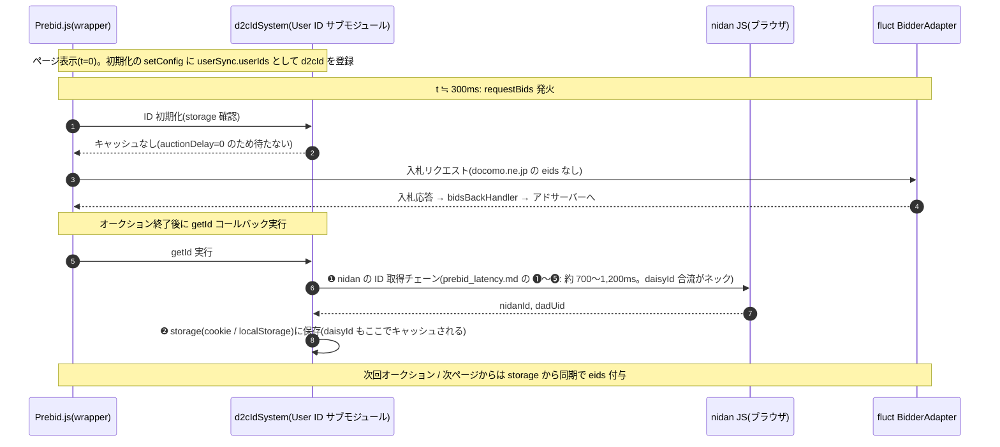
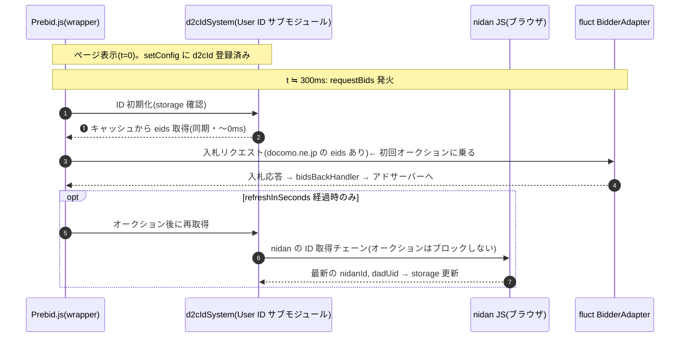

# 王道の User ID サブモジュール方式にした場合のシーケンス(仮: d2cIdSystem)

現行の pubProvidedId + `mergeConfig`/`refreshUserIds` の後付け登録([prebid_latency.md](prebid_latency.md) 参照)ではなく、
専用サブモジュールを実装して**最初の `setConfig`(`userSync.userIds`)に組み込む**場合のシーケンス。
BidderAdapter は仮に **fluct** としている。

## Prebid 公式仕様のポイント

- サブモジュールは `storage` 設定(cookie / html5、`expires` / `refreshInSeconds`)を持ち、**取得した ID を Prebid が自動でキャッシュ**する。キャッシュがあればオークション時に**同期(〜0ms)で eids が付与**される。
- キャッシュが無い場合、`auctionDelay=0`(デフォルト)では**取得処理(getId コールバック)はオークション終了後に実行**され、結果は storage に保存されて次回以降に使われる。`auctionDelay>0` ならその時間まで初回オークションを待たせられる。

前提条件(RTT・requestBids ≒300ms 等)は [prebid_latency.md](prebid_latency.md) と同じ。

## ケース C: 初回訪問(storage キャッシュなし・auctionDelay=0)

初回オークションに乗らない点は現行方式と同じだが、**取得結果が storage にキャッシュされる**点が異なる。

## ケース D: 再訪問(storage キャッシュあり)

**初回オークションに間に合う。** オークション経路上のネットワーク往復がゼロになる。

## 王道方式にした場合の効果と限界

- **効果**: ID が Prebid の storage にキャッシュされるため、**daisyId を含めて再訪問では同期で eids が乗る**。現行方式の「daisyId が永続化されず毎ページ 300〜450ms の往復 → 毎回乗り遅れる」構造が解消され、遅延を払うのは初回訪問(+ refresh 時)の 1 回だけになる。
- **限界**: 初回訪問(キャッシュなし)が初回オークションに乗らない点は変わらない。`auctionDelay`(現実的には 200〜500ms 程度)で待たせる手はあるが、現行の取得チェーンは約 700〜1,200ms かかり超過する。**daisyId の合流(DaisySync JSONP + WaitTask 待ち)がネック**である点はこの方式でも同じで、初回も乗せたいなら NidanSync と DaisySync の並列化・取得の高速化とセットで auctionDelay を設定する必要がある。

## 責務分担

storage へのキャッシュ処理そのものは Prebid.js 本体(User ID モジュールのコア)が共通処理として担う。
サブモジュール(d2cIdSystem)が実装するのは `getId`(nidan からの ID 取得)と `decode`(eids 形式への変換)のみで、
cookie / localStorage の読み書き・有効期限(`expires`)・再取得判定(`refreshInSeconds`)の実装は不要。

| 責務 | 担い手 |
|---|---|
| キャッシュ機構の実装(読み書き・期限管理) | Prebid.js 本体(User ID モジュールコア) |
| サブモジュール(getId / decode)の実装・提供 | D2C(nidan 側) |
| pbjs ビルドへの同梱(User ID モジュール + d2cIdSystem) + `storage` 設定込みの `setConfig` 記述 | wrapper 事業者(fluct 等) |

注意点: `storage` 設定を書かなければキャッシュは働かず、毎回 `getId` が呼ばれる構成になる。
王道方式への移行は「サブモジュールを作って渡せば終わり」ではなく、
**wrapper 事業者に storage 設定込みの `setConfig` を入れてもらうこと(および auctionDelay を設定するか否かの合意)が連携要件になる**ため、各社との調整項目に含めること。

## 現行方式との比較まとめ

| | ケース A(現行・NidanID あり) | ケース B(現行・NidanID なし) | ケース C(王道・初回) | ケース D(王道・再訪問) |
|---|---|---|---|---|
| nidan の戻り合計 | 約 350〜700ms | 約 700〜1,200ms | 約 700〜1,200ms(オークション後) | 〜0ms(キャッシュ) |
| requestBids(≒300ms)からの遅れ | 約 100〜400ms | 約 400〜900ms | オークション後に取得 | 遅れなし |
| 初回オークションの入札リクエストに eids が乗るか | ほぼ乗らない | 乗らない | 乗らない(次回から乗る) | **乗る** |
